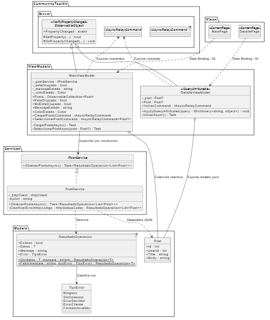
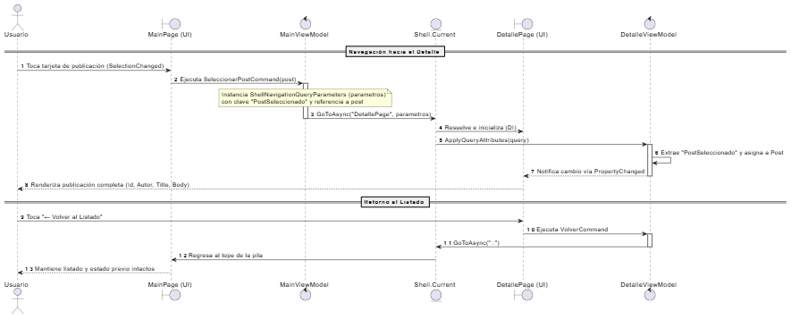

# ¿Cómo Funciona la Arquitectura de Nuestra App?


## 1. Justificación del Desacoplamiento Arquitectónico

En aplicaciones móviles basadas en frameworks modernos, la concentración de responsabilidades dentro del archivo de interfaz o su código subyacente (*code-behind*, `.xaml.cs`) conduce a antipatrones de diseño, comúnmente denominados *código espagueti*. Dicha práctica genera un alto acoplamiento entre la interfaz visual, las reglas de negocio y el acceso a datos.

Para garantizar los atributos de calidad de software requeridos (mantenibilidad, escalabilidad y testabilidad), el sistema adopta el principio de **Separación de Responsabilidades (SoC)** mediante la implementación estricta de:
* El patrón de presentación **MVVM (Model - View - ViewModel)**.
* La adopción de la biblioteca oficial **CommunityToolkit.Mvvm** para la eliminación de código repetitivo (*boilerplate*) mediante generadores de código en tiempo de compilación (*Source Generators*).
* El principio de **Inversión de Dependencias (DIP)** articulado a través del contenedor nativo de **Inyección de Dependencias (DI)** de .NET MAUI.
* Servicios dedicados para la integración con la capa de red (APIs REST).

---

## 2. Implementación del Patrón MVVM y CommunityToolkit.Mvvm

El patrón MVVM estructura la presentación en tres componentes fundamentales con responsabilidades acotadas:

```
[ View (XAML) ] <--- Data Binding / IAsyncRelayCommand ---> [ ViewModel (ObservableObject) ] <--- Servicios / DI ---> [ Model ]
```

### 2.1 Modelo (`Model`)
Representa la estructura de las entidades de dominio y datos crudos del sistema. Se mantiene completamente agnóstico a la tecnología visual y a la infraestructura de red.
* **Componente:** `Post.cs`
* **Responsabilidad:** Encapsula las propiedades de la entidad recibida desde la API externa (`Id`, `UserId`, `Title`, `Body`) mediante tipos de datos primitivos de C# y atributos de `System.Text.Json` (`[JsonPropertyName]`).

### 2.2 Vista (`View`)
Define la estructura visual y distribución de los elementos de la interfaz de usuario en lenguaje declarativo XAML.
* **Componentes:** `MainPage.xaml` y `DetallePage.xaml`.
* **Criterio de diseño:** Carece por completo de lógica algorítmica y de negocio en su *code-behind*. Su comportamiento está supeditado a los datos provistos por su contexto de enlace (`BindingContext`), resolviendo la interacción del usuario mediante comandos.

### 2.3 ViewModel (`ViewModel`)
Actúa como intermediario de presentación entre la Vista y los servicios de la aplicación.
* **Componentes:** `MainViewModel.cs` y `DetalleViewModel.cs` (ambos heredando de `ObservableObject`).
* **Responsabilidades y uso del Toolkit:**
  * **Notificación de Cambios y Source Generators:** Se utiliza la clase base `ObservableObject` y el atributo `[ObservableProperty]` sobre campos de respaldo privados (`_estaOcupado`, `_mensajeEstado`, `_colorEstado`, `_post`). El compilador genera automáticamente en tiempo de compilación las propiedades públicas con notificación reactiva `PropertyChanged`, reduciendo drásticamente el código repetitivo.
  * **Comandos Asíncronos Declarativos:** Mediante el atributo `[RelayCommand]`, los métodos asíncronos (`CargarPostsAsync`, `SeleccionarPostAsync`, `VolverAsync`) se exponen a la vista como comandos de tipo `IAsyncRelayCommand`. Esto gestiona la concurrencia, evita ejecuciones concurrentes indebidas y actualiza el estado de habilitación de controles (`CanExecute`).
  * **Orquestación:** Delega la obtención de información a la capa de servicios y formatea el estado contextual antes de entregarlo a la Vista.


## 3. Capa de Servicios y Consumo de APIs REST

Para evitar la duplicación de código y aislar las operaciones de entrada/salida (I/O) de red, la interacción con la API de JSONPlaceholder se encapsula en una capa de servicio autónoma.

### 3.1 Contrato de Abstracción (`IPostService`)
Define el contrato funcional que requiere la aplicación:
```csharp
public interface IPostService
{
    Task<ResultadoOperacion<List<Post>>> ObtenerPostsAsync();
}
```
El uso de una interfaz permite desacoplar los consumidores (ViewModels) de la implementación tecnológica concreta, facilitando la futura sustitución del proveedor de datos o la incorporación de dobles de prueba (*mocks/fakes*) en entornos de testeo unitario.

### 3.2 Implementación (`PostService`)
* Utiliza una instancia compartida de `HttpClient` inyectada como `Singleton` para evitar el agotamiento de sockets en el sistema operativo.
* Implementa una estrategia granular de manejo de excepciones asíncronas con bloques `catch` jerárquicos, diferenciando:
  * Errores de conectividad de bajo nivel y tiempo de espera (`HttpRequestException`, `TaskCanceledException`).
  * Respuestas erróneas del protocolo HTTP (`4xx` para errores de cliente, `5xx` para errores de servidor) mediante la envoltura `ResultadoOperacion<T>` y la enumeración `TipoError`.
* Deserializa la carga útil en formato JSON hacia colecciones de objetos C# mediante `System.Text.Json` con opciones de insensibilidad a mayúsculas/minúsculas.


## 4. Inversión de Control e Inyección de Dependencias (DI)

La solución elimina la instanciación directa (`new`) de dependencias de infraestructura dentro de las clases de presentación. En su lugar, el ensamblaje de la aplicación se centraliza en `MauiProgram.cs` mediante el contenedor integrado de .NET MAUI.

### Política de Ciclos de Vida
* **`Singleton`:** Aplicado al cliente de red y servicio (`HttpClient`, `IPostService` -> `PostService`). Se genera una única instancia durante todo el ciclo de vida de la aplicación, optimizando el consumo de recursos y reutilizando la infraestructura de red.
* **`Transient`:** Aplicado a los ViewModels (`MainViewModel`, `DetalleViewModel`) y las Páginas (`MainPage`, `DetallePage`). Se garantiza una instancia limpia e independiente en cada solicitud de navegación, evitando que el estado de una sesión previa persista de forma indebida.


## 5. Mecanismo de Navegación y Paso de Parámetros Complejos

La navegación entre la vista de listado y la vista de detalle se gestiona mediante el sistema declarativo basado en URI de **.NET MAUI Shell**.

Para resolver la transferencia de datos entre pantallas:
1. **Evitación de parámetros planos por URI:** Se desestima la descomposición de la entidad en cadenas primitivas individuales (`?id=1&title=texto`) debido a riesgos de truncamiento, incompatibilidad de codificación de caracteres o sobrecosto de re-consulta innecesaria.
2. **Transferencia por `ShellNavigationQueryParameters`:** Al invocarse la navegación con `Shell.Current.GoToAsync("DetallePage", parametros)`, se encapsula el objeto completo `Post` dentro de un diccionario transitorio que se limpia de memoria automáticamente tras la navegación.
3. **Consumo vía `IQueryAttributable`:** `DetalleViewModel` implementa el método `ApplyQueryAttributes(IDictionary<string, object> query)`, recuperando la referencia directa al objeto tipado sin problemas de temporización en constructores.

---

## 6. Referencias a Diagramas de Arquitectura

Para un análisis esquemático del sistema, consultar los diagramas modelados en PlantUML en este mismo directorio:
* **Estructura y Relación de Capas:** [`arquitectura.puml`](./arquitectura.puml)  
  

* **Secuencia de Navegación y Parámetros:** [`navegacion_secuencia.puml`](./navegacion_secuencia.puml)  
  

* **Instrucciones de compilación y visualización:** [`plantUML.md`](./plantUML.md)
